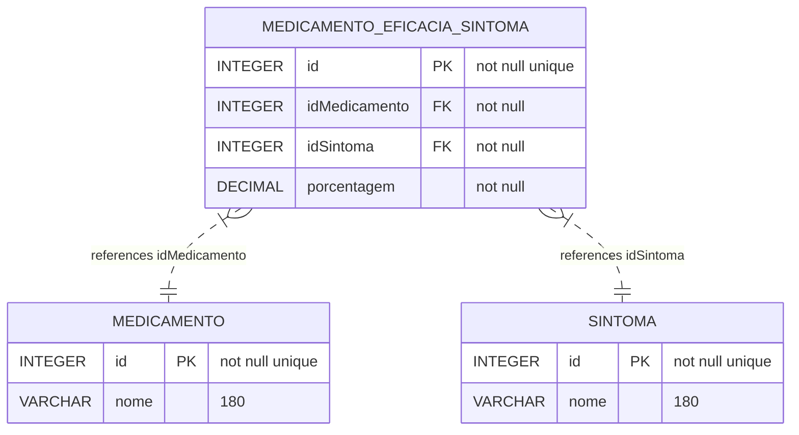

# Medicamento mais eficiente
Este projeto buscar selecionar o medicamento mais adequado, com base na maximização da eficácia, analisando todos os sintomas do paciente.

## Problema
Tendo m medicamentos e n sintomas, qual medicamento que devo tomar para maximizar o tratamento, e minimizar os sintomas.

Cada remédio contem um principio ativo, que alivia determinado sintoma, e para este sintoma ele possui uma porcentagem de tratamento associada.

Um paciente lista diversos sintomas, e o algoritmo calcula qual o remédio mais adequado que minimize os sintomas, e maximize sua saúde.


## Banco de dados




## SQL

#### Criação das tabelas

```sql

CREATE TABLE IF NOT EXISTS medicamento(
    id INTEGER NOT NULL UNIQUE,
    nome VARCHAR(180),
  	PRIMARY KEY(id)
);

CREATE TABLE IF NOT EXISTS sintoma(
    id INTEGER NOT NULL UNIQUE,
    nome VARCHAR(180),
  	PRIMARY KEY(id)
);

CREATE TABLE IF NOT EXISTS medicamento_eficacia_sintoma(
    id INTEGER NOT NULL UNIQUE,
    idMedicamento INTEGER NOT NULL,
    idSintoma INTEGER NOT NULL,
    porcentagem DECIMAL NOT NULL,
  	PRIMARY KEY(id),
  	FOREIGN KEY (idMedicamento) REFERENCES medicamento(id) ON DELETE CASCADE,
  	FOREIGN KEY (idSintoma) REFERENCES sintoma(id) ON DELETE CASCADE
);

```

#### Inserção dos dados de teste

```sql
-- Tabela medicamento
INSERT INTO medicamento (id, nome) VALUES (1, 'Paracetamol');
INSERT INTO medicamento (id, nome) VALUES (2, 'Ibuprofeno');
INSERT INTO medicamento (id, nome) VALUES (3, 'Amoxicilina');

-- Tabela sintoma
INSERT INTO sintoma (id, nome) VALUES (1, 'Dor de Cabeça');
INSERT INTO sintoma (id, nome) VALUES (2, 'Febre');
INSERT INTO sintoma (id, nome) VALUES (3, 'Tosse');

-- Tabela medicamento_eficacia_sintoma
INSERT INTO medicamento_eficacia_sintoma (id, idMedicamento, idSintoma, porcentagem) VALUES (1, 1, 1, 0.95);
INSERT INTO medicamento_eficacia_sintoma (id, idMedicamento, idSintoma, porcentagem) VALUES (2, 1, 2, 0.80);
INSERT INTO medicamento_eficacia_sintoma (id, idMedicamento, idSintoma, porcentagem) VALUES (3, 2, 1, 0.85);
INSERT INTO medicamento_eficacia_sintoma (id, idMedicamento, idSintoma, porcentagem) VALUES (4, 2, 2, 0.90);
INSERT INTO medicamento_eficacia_sintoma (id, idMedicamento, idSintoma, porcentagem) VALUES (5, 3, 3, 0.75);

```

#### Funcionalidades

```sql
-- Lista todos os medicamentos
SELECT id, nome FROM medicamento;
```

```sql
-- Lista todos os sintomas
SELECT id, nome FROM sintoma;
```

```sql
-- Lista todos os medicamentos, que tratam O sintoma, ordenando pela porcentagem de eficiencia
SELECT ms.id, ms.idMedicamento, ms.idsintoma, m.nome, s.nome, ms.porcentagem
	from medicamento_eficacia_sintoma ms
    LEFT JOIN sintoma s ON s.id == ms.idSintoma
    LEFT JOIN medicamento m ON m.id == ms.idMedicamento
    WHERE ms.idSintoma = 1
    ORDER BY ms.porcentagem DESC;
```

```sql
-- Lista todos os medicamentos, que tratam OS sintomas, ordenando pela porcentagem de eficiencia
SELECT ms.id, m.nome, s.nome as sintoma, ms.porcentagem, ms.idMedicamento, ms.idsintoma
	from medicamento_eficacia_sintoma ms
    LEFT JOIN sintoma s ON s.id == ms.idSintoma
    LEFT JOIN medicamento m ON m.id == ms.idMedicamento
    WHERE ms.idSintoma in (1, 2) --idSintoma
    ORDER BY sintoma ASC, ms.porcentagem DESC;
```